# Setupping Service Discovery Using Nginx & Consul

Service discovery is a critical aspect of modern microservices architecture, particularly in DevOps environments. In traditional monolithic systems, services or components were often tightly coupled, with one service directly specifying the address (like an IP or hostname) of another service it needed to communicate with. However, as systems grow more complex with the adoption of microservices, this approach quickly becomes inefficient and unmanageable. Let’s dive deeper into how service discovery works and how tools like Nginx and Consul can simplify it.

Why Service Discovery Matters in Microservices
In a microservices architecture, an application is broken down into small, independent services that can be deployed, scaled, and updated independently. Each of these services needs to communicate with other services in the architecture. However, services in this setup are often dynamic:

They can be deployed on different servers or containers.
They might scale up or down depending on the load.
They can move to different IP addresses if instances are recreated.
Because of this dynamic nature, hardcoding the locations (IP addresses or DNS names) of services is problematic:

Manual management becomes overwhelming: As services are added, removed, or scaled up and down, manually keeping track of where each service resides (in terms of IP or host) becomes an error-prone task.
Increased risk of failure: If a service address changes and the other services are still trying to reach the old address, it could lead to service disruptions or failures.
This is where service discovery comes into play.

Service Discovery with Nginx and Consul
Nginx and Consul together provide a dynamic way to automate service discovery.

Consul:

Consul is a popular service mesh solution that includes features like service discovery, health checks, key-value store, and more.
Consul Service Discovery: Consul allows services to register themselves dynamically when they start. Each service registers its location (IP, port) and health status with Consul. As a result, other services can query Consul to discover the location of services they need to communicate with.
Consul keeps track of which instances of each service are healthy, so services only communicate with other healthy instances. This increases reliability.
Nginx:

Nginx is widely used as a reverse proxy or load balancer in microservice architectures.
With service discovery, Nginx doesn't need to have hardcoded backend service addresses. Instead, it can dynamically discover services from Consul.
Nginx Dynamic Configuration: Nginx can be configured to use Consul as a source for the addresses of services it needs to proxy. This way, Nginx automatically routes requests to the correct services without needing manual updates each time services change.
How It Works: Dynamic Service Discovery in Action
Here’s a simplified workflow of how service discovery works using Nginx and Consul:

Service Registration:

When a microservice starts, it registers itself with Consul, providing its IP address, port, and a health check endpoint.
Health Check:

Consul continuously checks the health of all registered services. If a service instance goes down or becomes unhealthy, Consul will stop advertising it as available.
Service Query:

Nginx, or any other service, can query Consul to find the available instances of a service. Consul returns a list of healthy service instances.
Load Balancing with Nginx:

Nginx uses this information to load balance requests across the available service instances. If a service instance goes down or new instances are added, Nginx automatically adjusts without manual reconfiguration.
Why Use Nginx and Consul Together?

Flexibility: Nginx acts as a flexible reverse proxy or load balancer, while Consul provides robust service registration, discovery, and health checks.
Automation: The combination ensures that services dynamically register themselves and can be discovered without manual intervention. When services scale or move, Nginx automatically adapts using Consul's information.
Fault Tolerance: Consul ensures only healthy service instances are used, improving the reliability of the system.
Scalability: As services scale up or down, there’s no need to update Nginx manually — it queries Consul for the latest list of available instances.
Example Use Case
Imagine you have a microservice architecture for an e-commerce platform. It includes services like:
Inventory Service
Payment Service
Order Service
Each of these services runs in multiple instances to handle load, and their instances could be spread across multiple servers or containers. Using Nginx and Consul:

Each service registers with Consul, providing its instance IP and port.
Nginx, acting as a reverse proxy, queries Consul to get the latest list of healthy instances of, say, the Payment Service.
When a customer makes a payment, Nginx dynamically routes the request to a healthy Payment Service instance, ensuring high availability and efficiency.

# Key Concepts of Service Discovery
Service Registration: Service registration is the process of making a new service instance known to the system so it can be discovered by other services. When a service instance starts, it registers itself with a service registry, providing key details such as:

Network Location: This includes the IP address and port where the service can be accessed. These details allow other services to know where the new service instance is located.
Metadata: In addition to the network location, a service might provide other useful metadata, such as version information or the type of service (e.g., “payments” or “inventory”). This helps in routing requests more efficiently, ensuring that clients can find the correct version of the service they need.
In essence, service registration allows services to advertise themselves, making them discoverable by other components within the architecture.

Service Registry: The service registry is a central repository that keeps track of all the available service instances and their health statuses. It plays a critical role in service discovery, acting as the "phonebook" for the network. The registry contains:

A database that records each service’s details such as its network address, health status, and other relevant metadata.
A mechanism for services to register themselves when they start and to deregister when they shut down or become unhealthy.
Examples of popular service registries include:

Consul: A widely used service registry that also includes health checking and a key-value store for configuration data.
Eureka: Used primarily in the Netflix ecosystem for service discovery.
etcd: A distributed key-value store often used for service discovery in Kubernetes environments.
The registry allows other services to look up available instances dynamically, without requiring hardcoded addresses. It ensures that as services scale or move, the correct network locations are always available to clients.

Service Lookup/Discovery: Service lookup, or discovery, is the process by which a service finds the network locations of other services it needs to communicate with. Since service instances can change frequently, this lookup process ensures that the client always interacts with the right service. There are two main methods of service discovery:

Client-Side Discovery: In this model, the client itself is responsible for querying the service registry to find an available service instance. Once the client receives a list of available instances, it selects one (often using a load-balancing strategy like round-robin) and makes a request directly to that instance.

Advantages: Client-side discovery gives more control to the client regarding how requests are balanced across services. It also reduces the burden on the server.
Disadvantages: Each client must implement discovery logic, which can add complexity and require frequent updates to maintain.
Example: If you have a microservice (e.g., an “order service”) that needs to communicate with another service (e.g., a “payment service”), the “order service” will query the service registry to find healthy instances of the “payment service” and send a request directly to one of them.
Server-Side Discovery: In server-side discovery, the client simply sends its request to a load balancer or API gateway, which then queries the service registry on the client's behalf. The load balancer selects a healthy instance of the target service and forwards the request.

Advantages: The client doesn’t need to manage discovery logic, making it simpler to implement. The load balancer can handle advanced routing and traffic management.
Disadvantages: There is an additional hop (via the load balancer) which can introduce latency and adds a single point of failure if not highly available.
Example: A client sends a request to an API gateway, which in turn checks the registry to find a healthy instance of the backend service (e.g., “payment service”) and routes the client’s request to that service.
Health Checks: Health checks are mechanisms used to continuously monitor the health and availability of service instances. They ensure that only healthy instances are discoverable by other services. There are two types of health checks typically employed:

Active Health Checks: The service registry actively pings or queries each service at regular intervals to ensure it’s running properly (e.g., checking if a service’s endpoint is reachable or returning correct responses).
Passive Health Checks: These rely on observing the traffic and responses between services. If a service begins to fail (e.g., returning multiple 500 errors), the service registry may flag the service as unhealthy or remove it from the list of available instances.
If a service fails its health checks, it will be deregistered or marked as unavailable in the service registry, preventing other services from routing requests to it. This automatic deregistration is critical to ensure that clients don’t attempt to communicate with non-functional services, thereby increasing the reliability and resilience of the system.

Health checks are especially valuable in microservices environments, where services are frequently scaled up or down, and individual instances may fail or experience network issues. By ensuring that only healthy instances are discoverable, health checks help maintain the integrity of communication within the system.

# Benefits of Service Discovery
Dynamic Scalability: One of the biggest advantages of service discovery is its ability to handle the dynamic nature of modern, scalable architectures. As applications scale up or down—adding or removing instances of services based on demand—service discovery ensures that the network locations of all available services are kept up-to-date automatically.

How it works: When new instances of a service are added (for example, during a spike in traffic), they automatically register themselves with the service registry (like Consul). Similarly, if instances are removed (due to scaling down or failure), they deregister themselves or are marked as unavailable.
Benefit: This means clients or other services always have access to the most current, healthy service instances without needing any manual configuration or intervention. As a result, applications can seamlessly scale in response to demand without affecting communication between services.
Fault Tolerance: Service discovery plays a crucial role in ensuring fault tolerance within a microservices architecture. Fault tolerance refers to the ability of a system to continue operating properly even when parts of the system fail.

How it works: Service registries, like Consul, continuously monitor the health of service instances using health checks. If a service instance becomes unhealthy (e.g., it crashes or is unreachable), the registry updates its status and removes it from the list of discoverable services. As a result, other services will not try to communicate with that instance.
Benefit: This automatic removal of unhealthy services prevents service disruptions and helps avoid communication failures. If one service instance goes down, clients can still reach other healthy instances, thereby maintaining the overall availability of the system. By keeping only healthy services discoverable, the system becomes more resilient and fault-tolerant.
Simplified Configuration: Without service discovery, developers often need to manually configure service addresses (IP addresses or hostnames) in each service that depends on another. This is particularly cumbersome in environments where services are frequently scaled, moved, or changed.

How it works: With service discovery, instead of hardcoding service locations, developers use a service registry. The registry automatically keeps track of where services are located, and services query this registry to find the network locations of the services they need. This eliminates the need to manually update configurations every time services are added, removed, or relocated.
Benefit: This approach greatly simplifies configuration management. Developers no longer need to worry about updating service addresses in configuration files, nor do they need to redeploy applications whenever there’s a change in the service infrastructure. This makes the system easier to maintain and reduces the risk of errors due to misconfigurations.

## Project 5

|S/N | Project Tasks                                      |
|----|----------------------------------------------------|
| 1  |Deploy 4 Ubuntu Server                              |
| 2  |Allow required ports in the security group          |
| 3  |Set up architecture                                 |
| 4  |Setup Consul Server                                 |
| 5  |Setup Backend Servers                               |
| 6  |Setup Load-Balancer                                 |
| 7  |Validate Service Discovery Setup                    |

## Key Concepts Covered

- AWS (EC2 and Route 53)
- Linux(Ubuntu)
- Nginx
- Consul
- Environment Setup
- Service Registration with Consul
- Health Checks and Failover
- Load Balancing
- Monitoring and Logging
- Testing and Validation

## Checklist

- [x] Task 1: Deploy 4 Ubuntu Server
- [x] Task 2: Allow required ports in the security group
- [x] Task 3: Set up architecture
- [x] Task 4: Setup Consul Server
- [x] Task 5: Setup Backend Servers
- [x] Task 6: Setup Load-Balancer
- [x] Task 7: Validate Service Discovery Setup

## Documentation

Please reference [**Project1**](https://github.com/tearbu/first-project) for guidance on spinning up an Ubuntu server.

- Rename your EC2 instances to prevent any confusion during your project.

- Click on the **edit icon**.
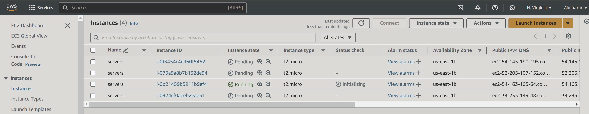

- Enter the new name in the **Name** field.

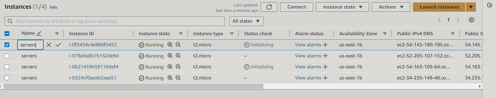

- Name your Consul server, LoadBalancer server, and the two backend servers for easy identification.


### Allow Required Ports In The Security Group

To ensure the proper functioning of the Consul service, please open the following ports in your security group and apply the same security group to all instances.

### Consul Servers

|S/N |Port Name  |Protocol      |Default Port   |
|----|-----------|--------------|---------------|
| 1  |DNS        |TCP and UDP   |8600           |
| 2  |HTTP API   |TCP           |8500           |
| 3  |HTTPS API  |TCP           |8501           |
| 4  |gRPC       |TCP           |8502           |
| 5  |gRPC TLS   |TCP           |8503           |
| 6  |Server RPC |TCP           |8300           |
| 7  |LAN Serf   |TCP and UDP   |8301           |
| 8  |WAN Serf   |TCP and UDP   |8302           |

-Click on your consul instance.
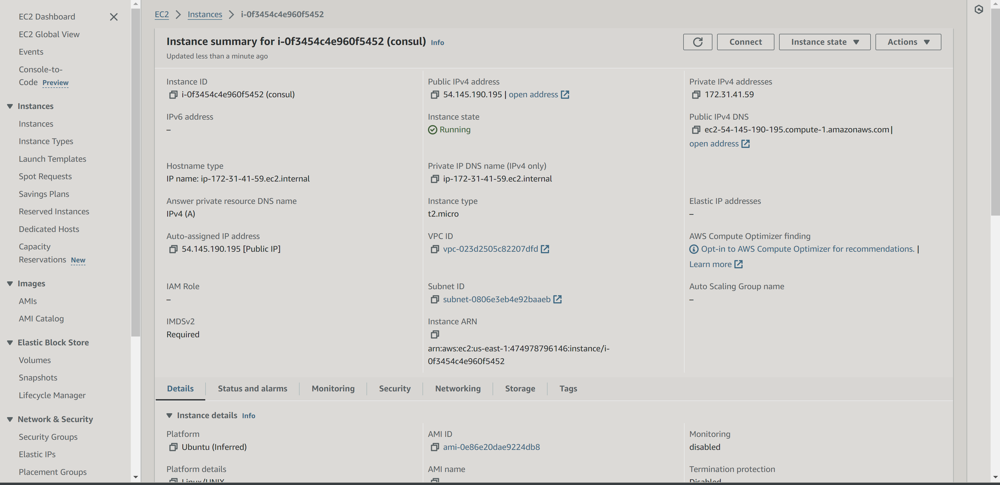
-Click on **Security**.
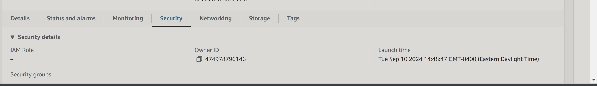
-Click on **Edit inbound rules**.
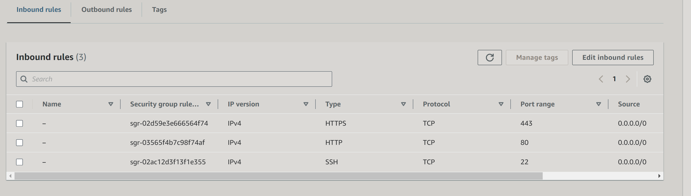
-Click on **Add Rule**.
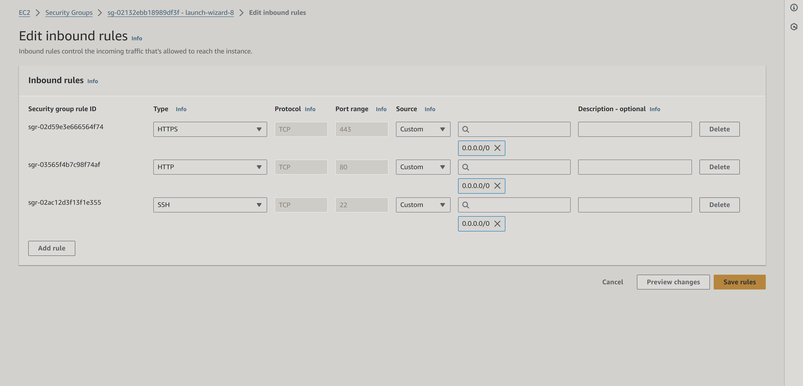
-Add the Type , Protocol and Port number range.
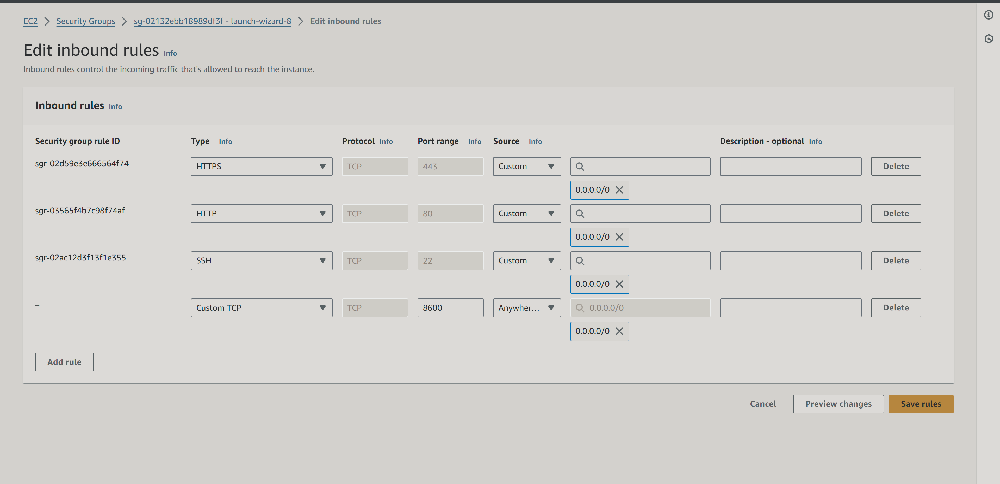
-Click on **Save**.
-Add the Other Type,Protocol and Port Number.
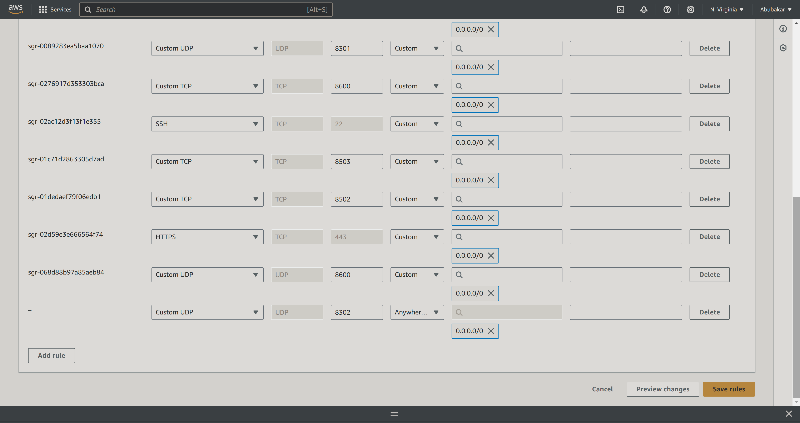
-Click on **Save**.

### Setup Consul Server

- SSH into the consul server and run **`sudo apt update`** to refresh the package cache.

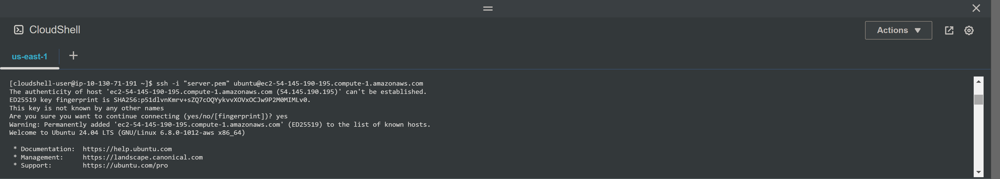

- Visit the consul [**downloads**](https://developer.hashicorp.com/consul/install) page to **copy** the installation command.

Or execute the following commands to install Consul.

```
wget -O- https://apt.releases.hashicorp.com/gpg | gpg --dearmor | sudo tee /usr/share/keyrings/hashicorp-archive-keyring.gpg

echo "deb [signed-by=/usr/share/keyrings/hashicorp-archive-keyring.gpg] https://apt.releases.hashicorp.com $(lsb_release -cs) main" | sudo tee /etc/apt/sources.list.d/hashicorp.list

sudo apt update && sudo apt install consul
```

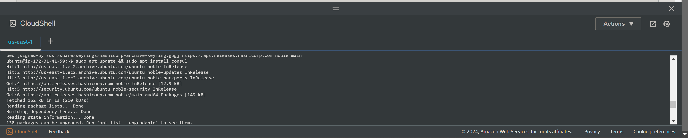


- Confirm Consul installation by checking its version with the **`consul --version`** command

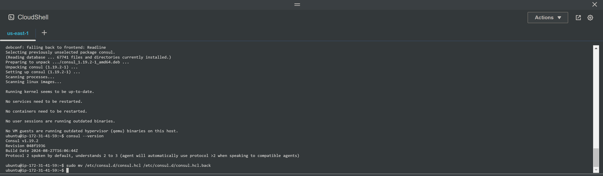

 All the Consul server configurations are located in the **`/etc/consul.d`** folder. To configure the Consul server, start by backing up the default configuration file **`consul.hcl`** by renaming it to **`consul.hcl.back`**, using the following command: **`sudo mv /etc/consul.d/consul.hcl /etc/consul.d/consul.hcl.back`**

 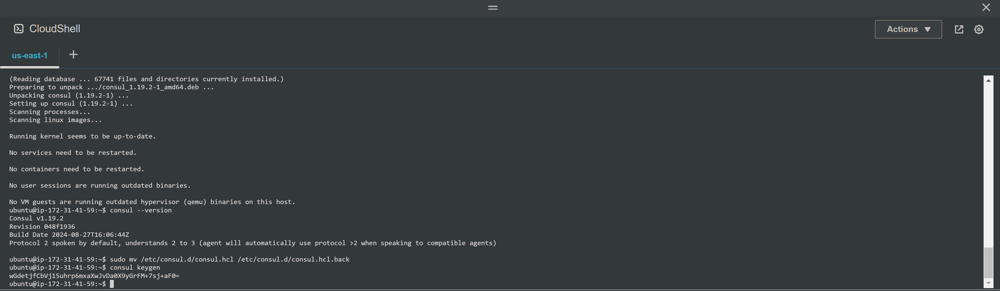

 - Generate an **encrypted key** using the **`consul keygen`** command.


Create a new file named **`consul.hcl`** in the **`/etc/consul.d`** directory, using the following command: **`sudo vi /etc/consul.d/consul.hcl`**

- Add the following content to the **`consul.hcl`** file, replacing **<YOUR_ENCRYPTED_KEY>** with the encrypted key you generated:
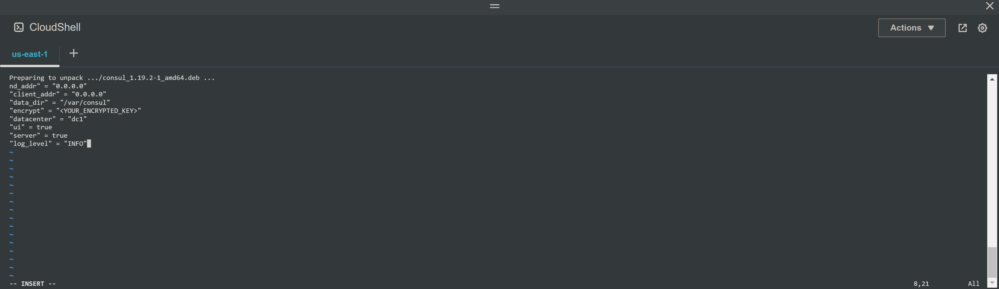

```
"bind_addr" = "0.0.0.0"
"client_addr" = "0.0.0.0"
"data_dir" = "/var/consul"
"encrypt" = "<YOUR_ENCRYPTED_KEY>"
"datacenter" = "dc1"
"ui" = true
"server" = true
"log_level" = "INFO"
```
- Save and exit the file.

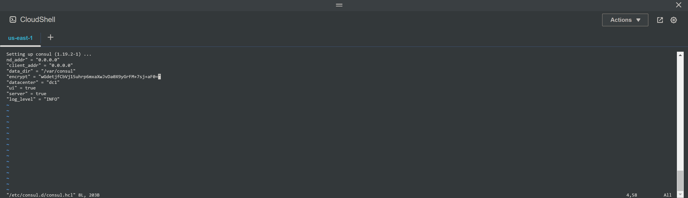

---

**Here's an explanation of each configuration setting in the Consul configuration file:**

1. **`bind_addr = "0.0.0.0"`**: Specifies the IP address on which Consul will bind to listen for incoming connections. `0.0.0.0` means Consul will listen on all available network interfaces.

2. **`client_addr = "0.0.0.0"`**: Determines the IP address on which the Consul client API will be available. Setting it to `0.0.0.0` allows connections from any IP address.

3. **`data_dir = "/var/consul"`**: Specifies the directory where Consul will store its data, such as the state and logs.

4. **`encrypt = "<YOUR_ENCRYPTED_KEY>"`**: Sets the encryption key for securing communication between Consul servers and clients. Replace this placeholder with your actual generated encryption key.

5. **`datacenter = "dc1"`**: Defines the datacenter name that this Consul server will use. Consul uses datacenters to organize services and nodes.

6. **`ui = true`**: Enables the Consul Web UI. This provides a graphical interface for interacting with Consul's data.

7. **`server = true`**: Indicates that this instance is a Consul server. Server nodes participate in the consensus protocol and store the state of the system.

8. **`log_level = "INFO"`**: Sets the verbosity of the logs. `INFO` level provides a balance of details, logging general information, warnings, and errors.

---

- Run the following command to start the Consul server in the background: **`sudo nohup consul agent -dev -config-dir /etc/consul.d/ &`**

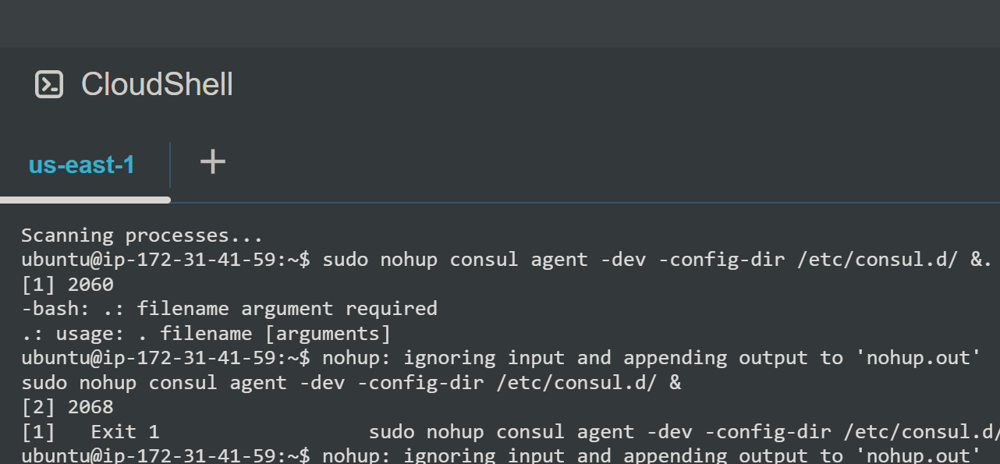

- If you visit **`<EC2 Consul Server IP>:8500`**, you should be able to access the Consul dashboard.

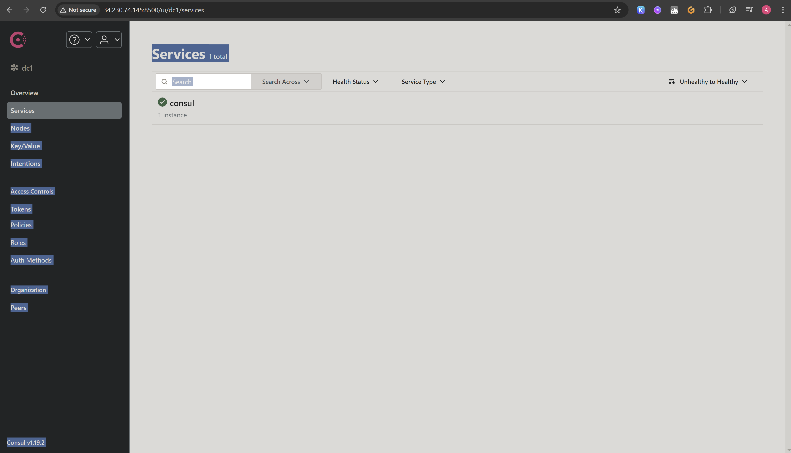

### Setup Backend Servers

Since we have the Consul server up and running, let's manage our Nginx backend servers more easily using service discovery. To do this, we'll install Nginx and the Consul agent on all the backend servers. The Consul agent acts like a messenger, automatically registering both the server and the Nginx service running on it with the Consul server, which acts like a central directory.


**Apply the configurations below on both backend servers:**

- SSH into the backend servers and run **`sudo apt-get update -y`** to update package information.
- Install Nginx on both instances by running the following command: **`sudo apt install nginx -y`**

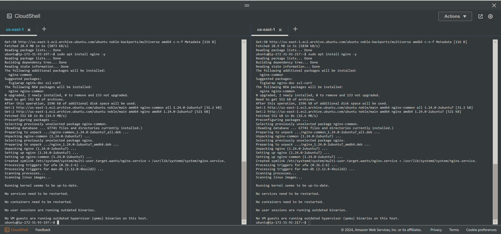

> [!NOTE]
After installing Nginx, navigate to the default HTML directory and modify the index.html file on both servers to differentiate them.

- Navigate to the HTML directory by executing the following command: **`cd /var/www/html`**.

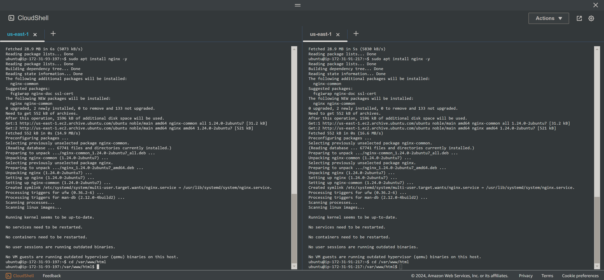

- Open the HTML file with your preferred text editor to make edits: **`sudo vi index.html`**.

- Copy the HTML content below into the index.html file. On the second server, replace **SERVER-01** with **SERVER-02** in the HTML file to differentiate between the two backend servers.

```
<!DOCTYPE html>
<html>
<head>
	<title>Kanekis Backend Server </title>
</head>
<body>
	<h1>This is Backend SERVER-01</h1>
</body>
</html>
```

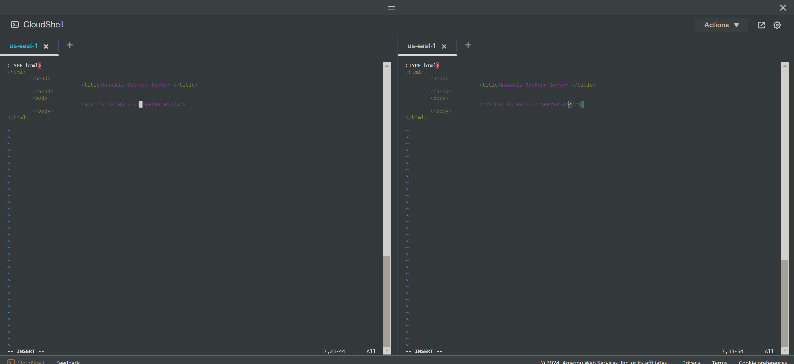

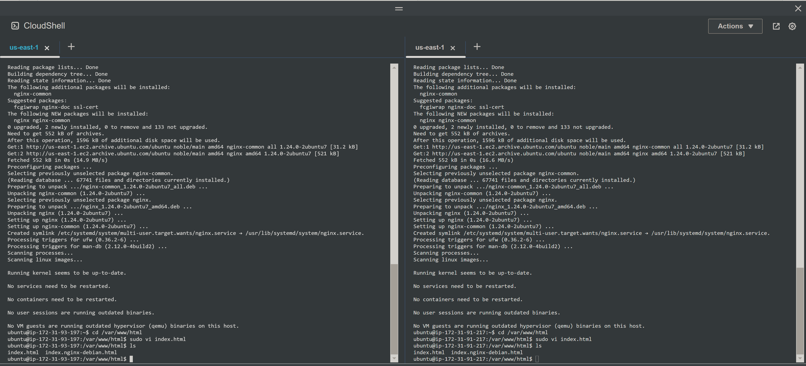

- Install Consul as an agent on the servers. Run the following commands to install Consul:

```
wget -O- https://apt.releases.hashicorp.com/gpg | gpg --dearmor | sudo tee /usr/share/keyrings/hashicorp-archive-keyring.gpg

echo "deb [signed-by=/usr/share/keyrings/hashicorp-archive-keyring.gpg] https://apt.releases.hashicorp.com $(lsb_release -cs) main" | sudo tee /etc/apt/sources.list.d/hashicorp.list

sudo apt update && sudo apt install consul
```
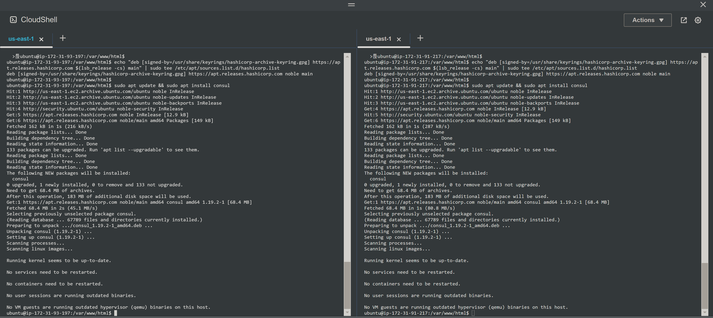

- Verify that Consul is installed properly by running the following command: **`consul --version`**.

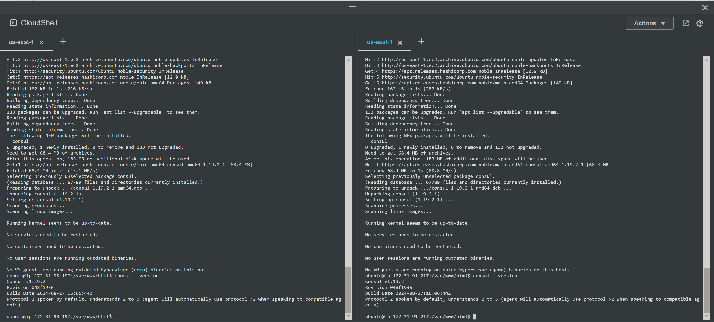

- Replace the default Consul configuration file **`config.hcl`** located in **`/etc/consul.d`** with your custom **`consul.hcl`** file.

- Rename the default file and create a new one by running the following commands:

```
sudo mv /etc/consul.d/consul.hcl /etc/consul.d/consul.hcl.back
sudo vi /etc/consul.d/consul.hcl
```
- Make sure to change the ip in the {start join} to your consul ip address and do that for bothof your backend server

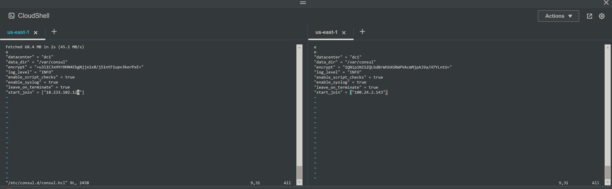


**Here's an explanation of the Consul agent configuration settings:**

1. **`server = false`**: Indicates that this node is not a Consul server, but a client (agent). A Consul server handles requests from other Consul agents, while a client node registers services and performs checks.

2. **`datacenter = "dc1"`**: Specifies the datacenter name where the Consul agent operates. This should match the datacenter configuration on the Consul server to ensure proper communication.

3. **`data_dir = "/var/consul"`**: Defines the directory where the Consul agent will store its data files. This directory must be writable by the Consul agent process.

4. **`encrypt = "<YOUR_ENCRYPTED_KEY>"`**: Provides the encryption key for securing communication between Consul agents and the Consul server. Replace **`<YOUR_ENCRYPTED_KEY>`** with the actual key generated using **`consul keygen`**.

5. **`log_level = "INFO"`**: Sets the verbosity of the log output. **`INFO`** level provides a balance between detail and readability, showing general information about Consul operations.

6. **`enable_script_checks = true`**: Enables the execution of script-based health checks. When set to **`true`**, the Consul agent can run custom scripts to check service health.

7. **`enable_syslog = true`**: Allows logging of Consul messages to the syslog service. When enabled, logs will be sent to the system's logging facility, which can be useful for centralized logging and monitoring.

8. **`leave_on_terminate = true`**: Ensures that the Consul agent will automatically deregister itself from the Consul server when the agent process is terminated. This helps maintain accurate service registration and avoids stale entries.

9. **`start_join = ["34.201.77.72"]`**: Lists the addresses of Consul servers or agents that this Consul client should contact when starting up to join the Consul cluster. Replace **`34.201.77.72`** with the IP address of your Consul server. This setting helps the agent locate and connect to the Consul server to begin registering services.

---


- Next, we need to create a **`backend.hcl`** configuration file in the **`/etc/consul.d`** directory to register the Nginx service and its health check URLs with the Consul server. This will enable the Consul server to continuously monitor the health of the Nginx service. Use the following command to create and edit the file: **`sudo vi /etc/consul.d/backend.hcl`**.

- Add the following contents to the **`backend.hcl`** file and save it.

```
"service" = {
  "Name" = "backend"
  "Port" = 80
  "check" = {
    "args" = ["curl", "localhost"]
    "interval" = "3s"
  }
}
```
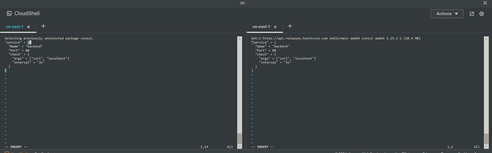

- This configuration registers your backend servers with the Consul server and sets up a health check that uses curl to test the service every 3 seconds.

- Verify the configurations by executing the following command: **`consul validate /etc/consul.d`**.

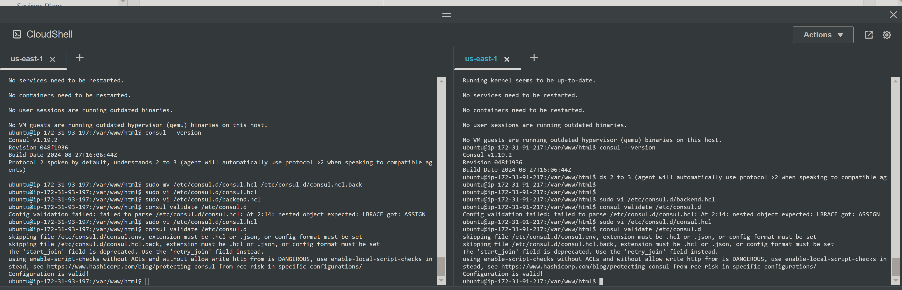

- Once all configurations are complete, start the Consul agent with the following command: **`sudo nohup consul agent -config-dir /etc/consul.d/ &`**.
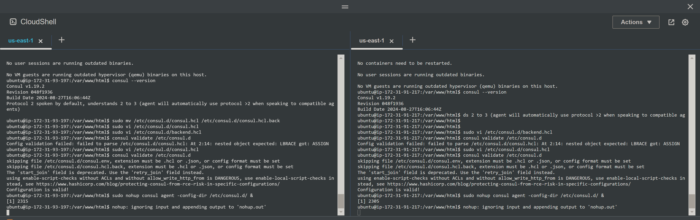

- To verify if everything is working correctly, visit your Consul UI. If you see the backend listed in the UI as depicted below, it indicates that the backend has successfully registered itself with Consul.

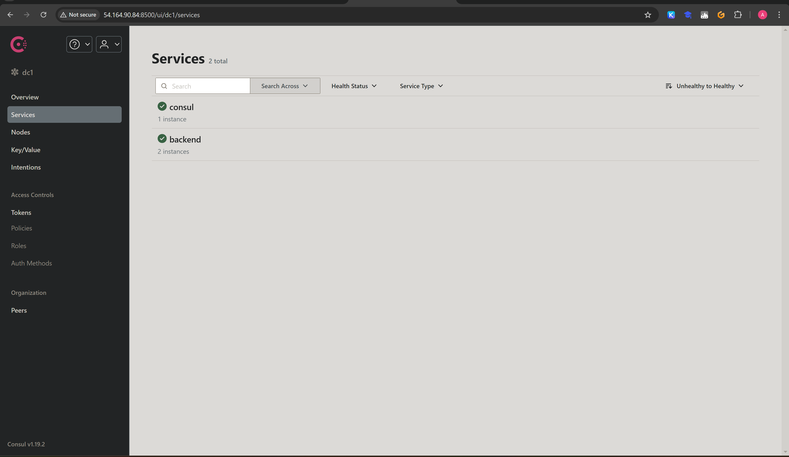

## Setting Up the load balancer
To configure the load balancer to dynamically update its backend server information using the service registry managed by Consul, we will employ the **`consul-template`** tool. This utility communicates with the Consul server through API calls to gather the backend server details. It then processes a template to replace placeholders with actual values and generates the **`loadbalancer.conf`** file, which Nginx uses to manage the load balancing.

- Log in to the load-balancer server. Update the package information and install unzip with the following commands:
```
sudo apt-get update -y
sudo apt-get install unzip -y
```
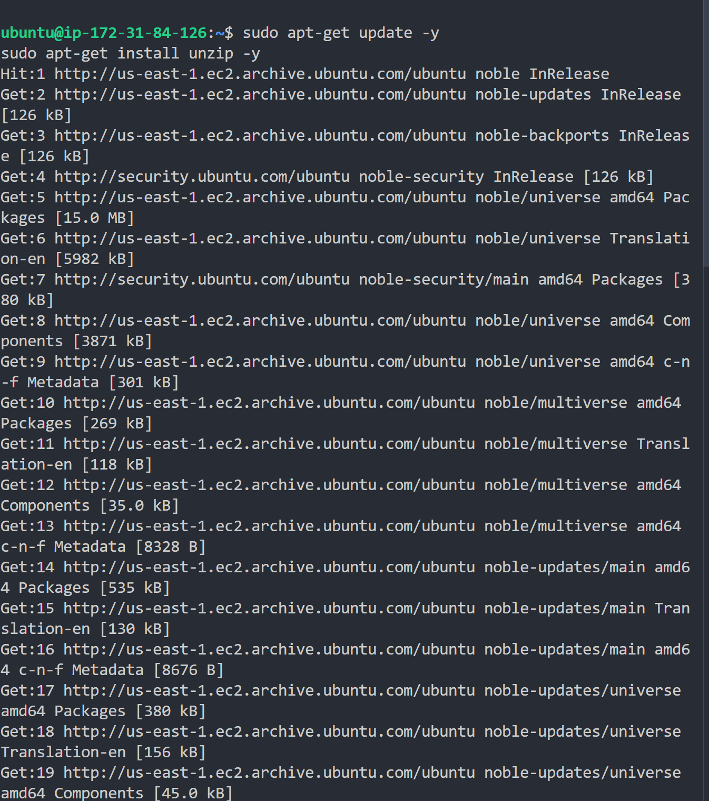

- Install Nginx using the following command: **`sudo apt install nginx -y`**.

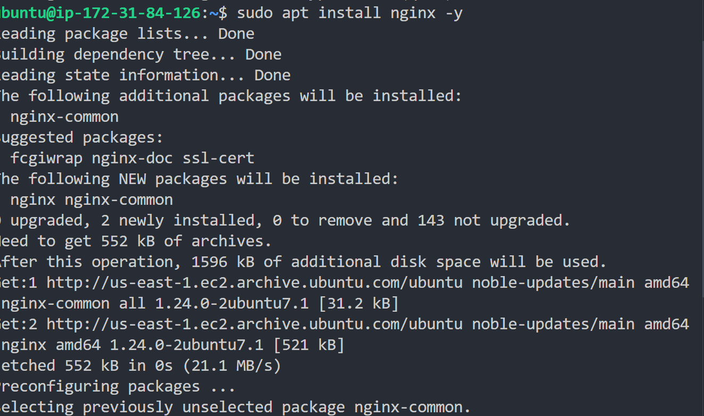


- Download the consul-template binary using the following command:

```
sudo curl -L  https://releases.hashicorp.com/consul-template/0.30.0/consul-template_0.30.0_linux_amd64.zip -o /opt/consul-template.zip

sudo unzip /opt/consul-template.zip -d  /usr/local/bin/
```
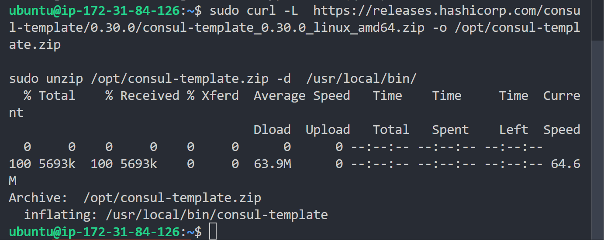

- To verify the installation of consul-template, check its version with the following command: **`consul-template --version`**.


- Create and edit a file named **`load-balancer.conf.ctmpl`** in the **`/etc/nginx/conf.d`** directory, using the following command: **`sudo vi /etc/nginx/conf.d/load-balancer.conf.ctmpl`**.

- Paste the following content into the file:

```
upstream backend {
 {{- range service "backend" }} 
  server {{ .Address }}:{{ .Port }}; 
 {{- end }} 
}

server {
   listen 80;

   location / {
      proxy_pass http://backend;
   }
}
```
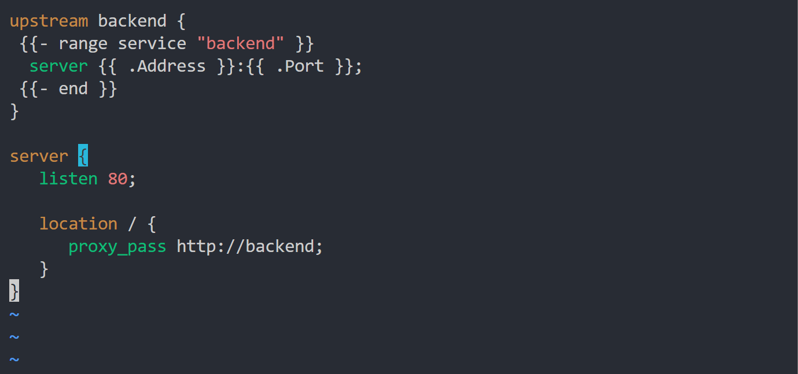


**Here's a breakdown of the configuration:**

1. **Upstream Block**

```
upstream backend {
 {{- range service "backend" }} 
  server {{ .Address }}:{{ .Port }}; 
 {{- end }} 
}
```

- **upstream backend:** This defines a group of backend servers that Nginx can load-balance requests across.
- **{{- range service "backend" }}:** This is a Consul-Template directive that iterates over all services registered with Consul under the name "backend".
- **server {{ .Address }}:{{ .Port }};:** For each backend service, it adds an entry to the upstream block with the server's address and port.
- **{{- end }}:** Ends the iteration block.

2. **Server Block**

```
server {
   listen 80;

   location / {
      proxy_pass http://backend;
   }
}

```
- **server:** Defines a virtual server that listens for incoming requests.
- **listen 80:** Specifies that this server block will listen on port 80 (the default HTTP port).
- **location /:** Defines a location block for all requests to the root URL (/).
- **proxy_pass http://backend:** Forwards incoming requests to the upstream group named "backend" defined above. Nginx will use the addresses and ports listed in the upstream backend block to balance the requests.

> [!NOTE]
This setup keeps Nginx's backend server list in sync with Consul's. It ensures that Nginx always routes traffic to the currently available backend servers.

---
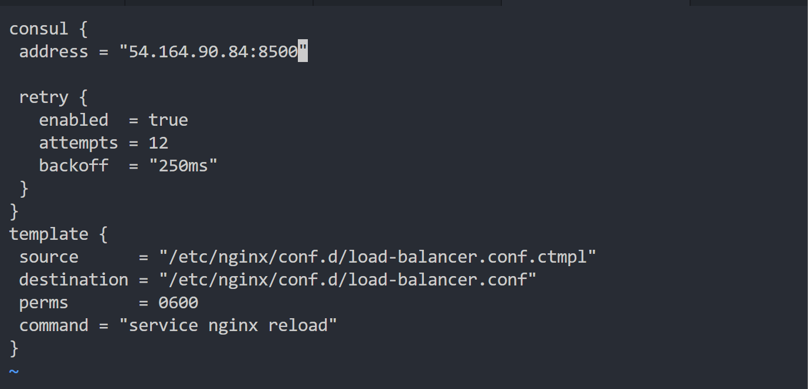

- Create a file named **`consul-template.hcl`** in the **`/etc/nginx/conf.d/`** directory. This configuration file is used by **consul-template** to specify details about the Consul server IP and the destination path where the processed load-balancer.conf file will be saved.

Use the following command to create and edit the file: **`sudo vi /etc/nginx/conf.d/consul-template.hcl`**.

- Add the following content to the file, replacing **`<Consul Server IP>`** with your Consul server's IP address. This configuration specifies the Consul server details, the path to the template file, the destination for the rendered Nginx configuration, and the command to reload Nginx after updating the configuration.

```
consul {
 address = "<Consul Server IP>:8500"

 retry {
   enabled  = true
   attempts = 12
   backoff  = "250ms"
 }
}
template {
 source      = "/etc/nginx/conf.d/load-balancer.conf.ctmpl"
 destination = "/etc/nginx/conf.d/load-balancer.conf"
 perms       = 0600
 command = "service nginx reload"
}
```


- Delete the default server configuration to disable it by running the following command: **`sudo rm /etc/nginx/sites-enabled/default`**.

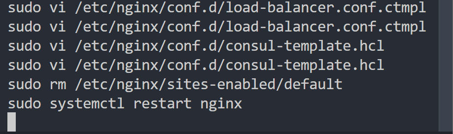

- Restart the Nginx service to apply the changes: **`sudo service nginx restart`**

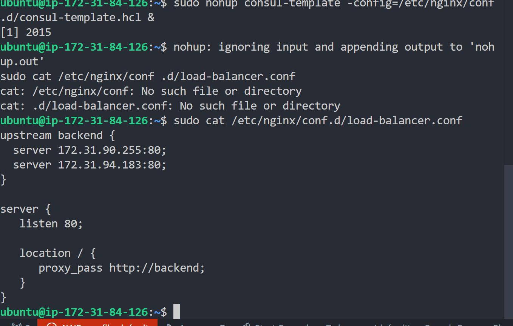

- Once configurations are complete, start the Consul Template agent using the following command. It continuously monitors Consul for changes.

```
sudo nohup consul-template -config=/etc/nginx/conf.d/consul-template.hcl &
```


- Upon completion, a load-balancer.conf file will be created with backend server information populated from the Consul service registry.

-Now, if you access the load balancer IP in your web browser, it will display the custom HTML content from one of the backend servers. When you refresh the page, the load balancer will route your request to the other backend server, displaying its custom HTML content

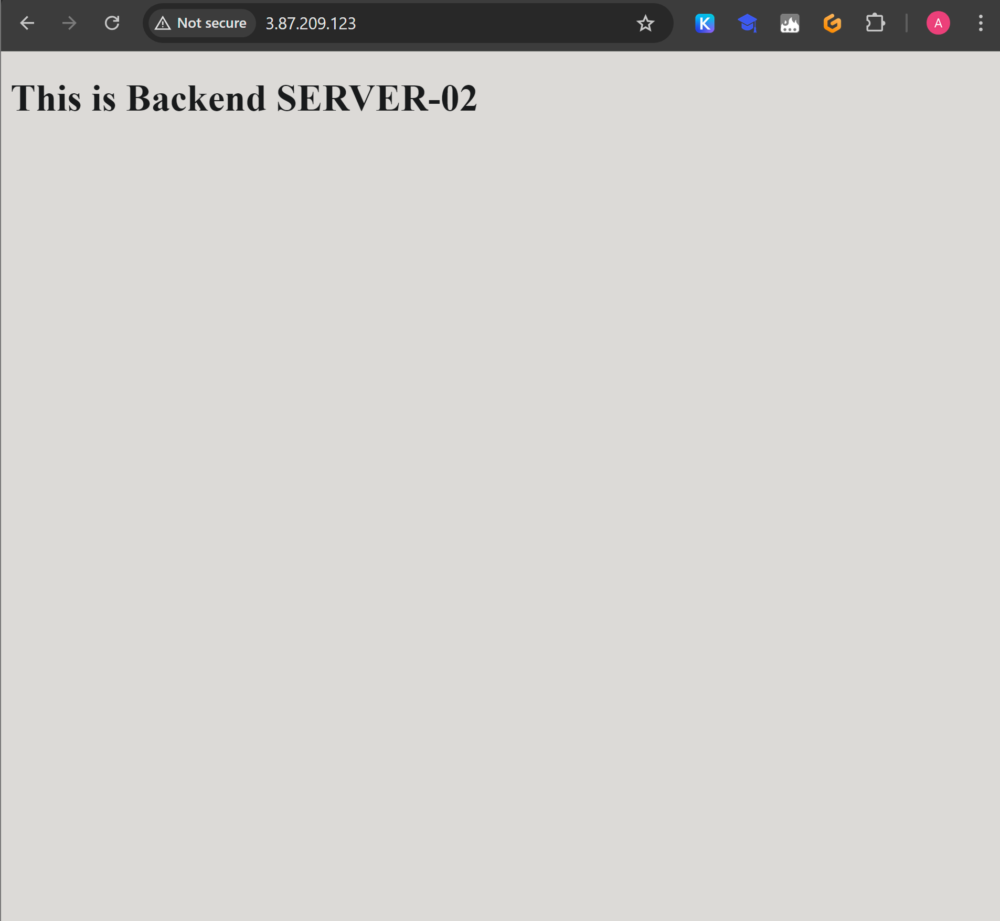

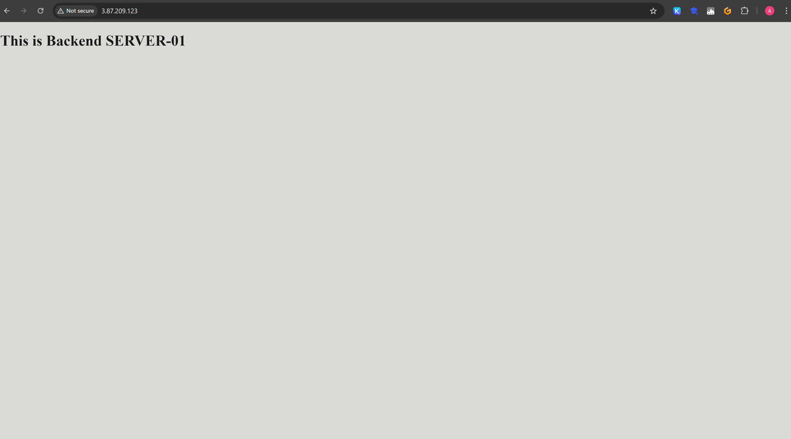


- As a result, the load balancer will only direct traffic to the remaining healthy backend servers. This ensures that your application continues to run smoothly without any disruption to users, demonstrating the effectiveness of your service discovery and health check configuration with Consul and Nginx

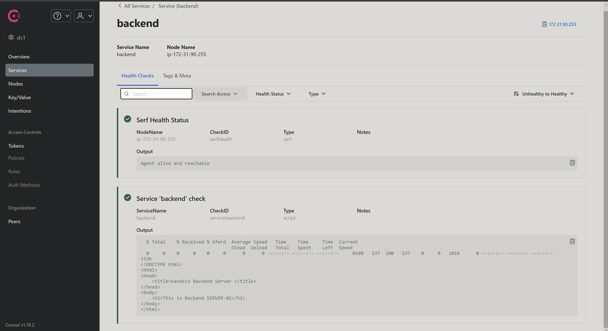

**Service Check:** These checks are specific to the services running on the nodes (in this case, Nginx). When you stopped Nginx, the service check that monitors the health of Nginx on that particular node would fail, leading to the "all service checks failed" error.
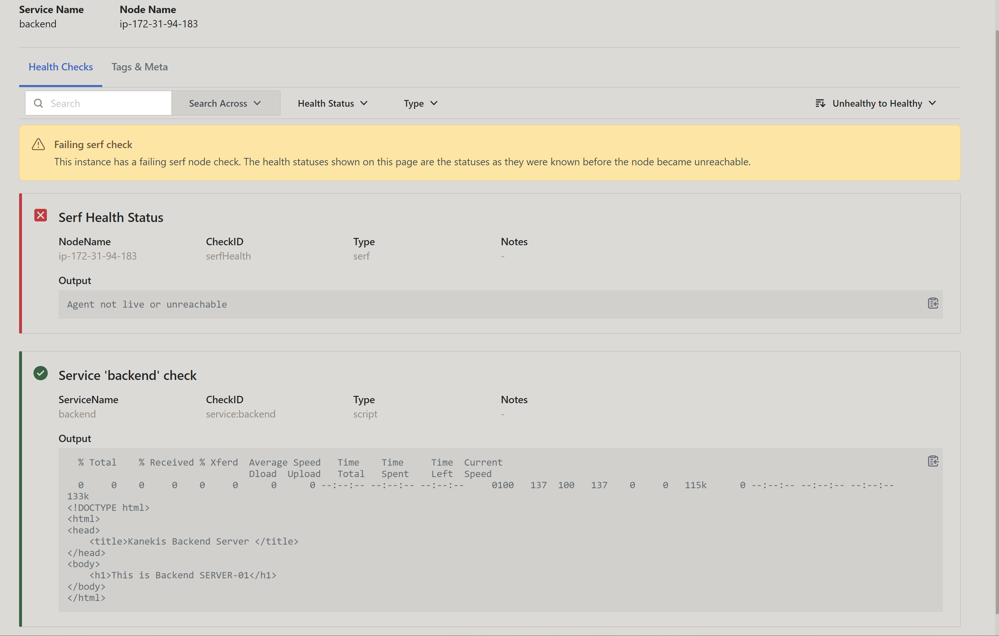
**Node checks:** These checks monitor the overall health of the node itself, which includes the underlying operating system and possibly other metrics (like CPU, memory, and disk usage). Since stopping Nginx does not necessarily mean the node is unhealthy (the node could still be up and running, responding to pings, etc.), the node checks would still pass.

#### The End Of Project 5